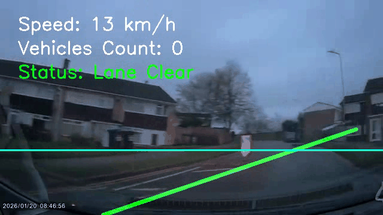
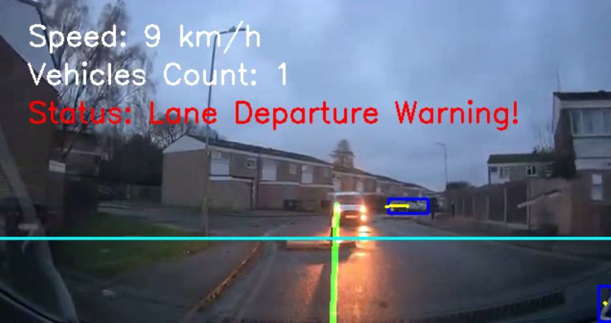
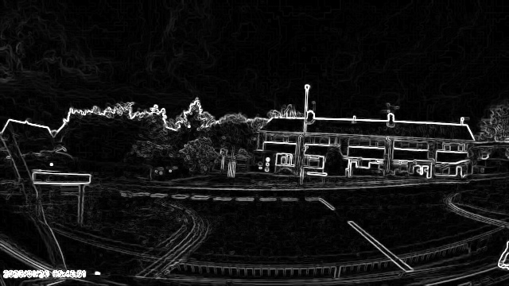
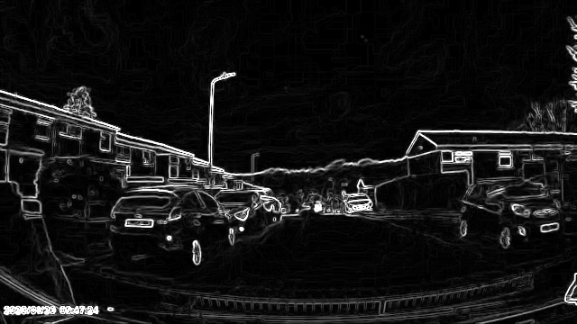

# Advanced Driver Assistance System (ADAS) Pipeline

### 🚗 Output Video Demonstration
*(A 5-second preview of the pipeline in action. For the full experience, view the raw `output_video.mp4` file in the project folder.)*



## Overview


This project implements a Real-Time Driver Assistance Pipeline utilizing classical Computer Vision techniques and modern Deep Learning. It processes dashcam footage to provide critical safety features, including lane departure warnings, vehicle detection, tracking, proximity alerts, and traffic counting. 

The pipeline is built using **OpenCV** for mathematical image processing and **Ultralytics YOLOv8** for robust, real-time object detection.

## Features
- **Lane Detection:** Utilizes Grayscale conversion, Gaussian Blurring, Canny Edge Detection, and Hough Transform algorithms to identify and highlight road lanes.
- **Lane Departure Warnings:** Analyzes lane geometry to trigger visual warnings if the vehicle begins to drift out of its designated lane boundaries.
- **Vehicle Detection & Tracking:** Leverages a pre-trained YOLOv8 Nano model to accurately identify and track cars, motorcycles, buses, and trucks across multiple frames.
- **Proximity Alerts:** Calculates the relative bounding box area of vehicles ahead to issue high-priority warnings if a vehicle is dangerously close (tailgating).
- **Traffic Counting:** Tracks vehicle trajectories and counts the total number of vehicles passed during the drive.
- **Dynamic HUD:** Overlays a real-time Heads-Up Display (HUD) containing speed estimation, lane status, vehicle counts, and critical safety warnings.

## Project Structure
- `main.py`: The core application. Processes the full `input_video.mp4`, performs all detection/tracking logic in real-time, and generates the annotated `output_video.mp4`.
- `evaluate.py`: A diagnostic script used to test the pipeline on a 50-frame sample. Outputs performance metrics like Lane Detection Success Rate and Average Vehicles Detected per Frame.
- `sobel_manual.py`: An educational utility script that demonstrates the mathematical foundation of edge detection by applying manual Sobel operators (via `scipy.signal.convolve2d`) to sampled frames.

## Prerequisites
Ensure you have Python installed (preferably version 3.8+). The project relies on the following major libraries:
- `opencv-python`
- `numpy`
- `scipy`
- `ultralytics` 

## Installation & Setup
It is highly recommended to use a Python Virtual Environment (`.venv`) to isolate the project dependencies.

1. **Navigate to the Project Directory:**
   Ensure you are in the root folder containing the source code.

2. **Activate the Virtual Environment:**
   If you have a pre-configured `.venv` directory, activate it:
   ```powershell
   # Windows PowerShell
   .\.venv\Scripts\activate
   ```

3. **Install Dependencies:**
   *(If you are setting this up from scratch)*
   ```bash
   pip install opencv-python numpy scipy ultralytics
   ```

4. **Prepare Input Data:**
   Ensure your raw dashcam footage is named `input_video.mp4` and is placed in the root directory alongside the scripts. The first time you run the scripts, the `yolov8n.pt` weights file will be downloaded automatically.

## Usage

### 1. Evaluate Pipeline Accuracy (Diagnostic Check)
Before processing a full video, run a quick 50-frame diagnostic test to ensure the environment and models are functioning properly:
```powershell
python evaluate.py
```

### 2. Generate Gradient Maps (Educational)
To visualize manual Sobel edge detection mathematically on 10 equidistant sample frames from the video:
```powershell
python sobel_manual.py
```
*Results will be saved as images in the automatically generated `gradient_maps/` directory.*

**Example Gradient Maps:**
<p float="left">
  
  
</p>

### 3. Run the Main Pipeline
To process the entire video, track objects, and generate the HUD-annotated output:
```powershell
python main.py
```
*The final result will be saved as `output_video.mp4` in the project directory.*

## Methodology & Architecture
- **Lane Processing:** Frames are converted to grayscale and blurred to remove noise. Canny edge detection isolates sharp gradients. A polygonal Region of Interest (ROI) mask focuses the algorithm strictly on the road ahead. Finally, the Probabilistic Hough Transform connects edge pixels into definitive lane lines.
- **Object Detection:** The pipeline utilizes Transfer Learning via a YOLOv8 Nano model (`yolov8n.pt`), pre-trained on the COCO dataset. A strict class filter `[2, 3, 5, 7]` is applied to specifically isolate target vehicles.
- **Tracking & Counting Logic:** Bounding box centroids are calculated and stored in a temporal history queue, allowing for visual trajectory rendering and line-crossing calculations for accurate traffic counting.

---
*Created for Viva / Academic Demonstration Purposes*
